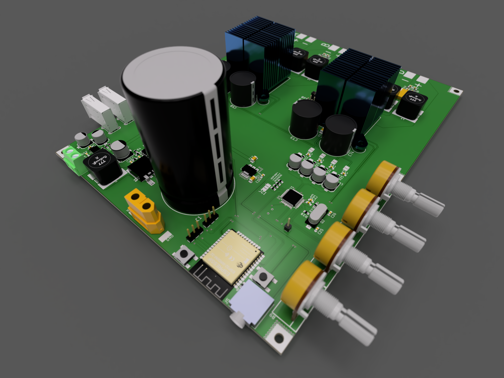

# LautIO
Mobile PA-System solution

## Hardware Features

- [x] ESP32 (WiFi + Bluetooth)
- [x] ADAU1701 Digital Signal Processor
- [x] 12V, 5V & 3.3V Power Supply from Battery
- [x] 2x TDA7498E Amplifier

## Fancy Rendering

## Third party resources
This git repository contains links or files of the following projects:
* `Bootstrap 5` released under the MIT license. (c) 2021 Twitter
* `jQuery 3.6.0` released under the MIT license. (c) 2021 OpenJS Foundation
* `PlatformIO` released under the Apache 2.0 license. (c) 2021 PlatformIO
* `ESPAsyncTCP` released under the GNU LGPL license. (c) 2021 https://github.com/me-no-dev
* `ESPAsyncWebServer` released under the GNU LGPL license. (c) 2021 https://github.com/me-no-dev
* `SigmaDSP library` released under the GNU LGPL license. (c) 2021 https://github.com/MCUdude
* `ArduinoJson library` released under the MIT license. (c) 2021 Benoît Blanchon
* `Dark-Mode-Switch` released under the MIT license. (c) 2019 Christian Oliff (https://github.com/coliff/dark-mode-switch)

## License
MIT License

Copyright (c) 2021 olel

Permission is hereby granted, free of charge, to any person obtaining a copy
of this software and associated documentation files (the "Software"), to deal
in the Software without restriction, including without limitation the rights
to use, copy, modify, merge, publish, distribute, sublicense, and/or sell
copies of the Software, and to permit persons to whom the Software is
furnished to do so, subject to the following conditions:

The above copyright notice and this permission notice shall be included in all
copies or substantial portions of the Software.

THE SOFTWARE IS PROVIDED "AS IS", WITHOUT WARRANTY OF ANY KIND, EXPRESS OR
IMPLIED, INCLUDING BUT NOT LIMITED TO THE WARRANTIES OF MERCHANTABILITY,
FITNESS FOR A PARTICULAR PURPOSE AND NONINFRINGEMENT. IN NO EVENT SHALL THE
AUTHORS OR COPYRIGHT HOLDERS BE LIABLE FOR ANY CLAIM, DAMAGES OR OTHER
LIABILITY, WHETHER IN AN ACTION OF CONTRACT, TORT OR OTHERWISE, ARISING FROM,
OUT OF OR IN CONNECTION WITH THE SOFTWARE OR THE USE OR OTHER DEALINGS IN THE
SOFTWARE.
